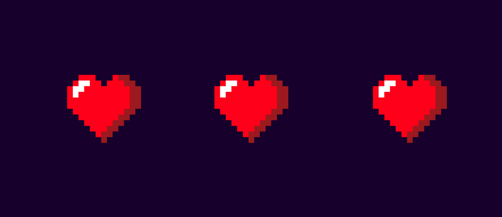

# Excel Pixel Drawer



## Описание
Простой скрипт, который позволяет рисовать пиксельную графику, используя excel в качестве полотна. Заливая цветом 
ячейки в документе, мы получаем на выходе картинку в формате - png. bmp, jpg.


## Как использовать?
### Пиксельное изображение из Excel
Например, чтобы получить пиксельную картинку из xls файла, создаем переменную и присваиваем ей результат 
вызова метода **_getPixelColors_**, в котором первым параметром указываем путь к файлу(_.xlsx_), 
а вторым - название листа, на котором хранится наш рисунок. 

> В методе **_renderImage_** вторым параметром можно указать свой размер пикселя (плитки). По умолчанию он равен 10. 
> Пример **_renderImage(res, 20)_** отрисует картинку с размером пикселя (плитки) 20px.

Затем переменную передаем в **_renderImage_**. Результат записываем с помощью **_writeImage_**, где первый параметр - 
результат вызова метода **_renderImage_**, а второй - путь к файлу.


```kotlin
    // загружаем массив пикселей из файла pix.xlsx и листа с названием editor
    val res = getPixelColors("D:/pix.xlsx","editor")

    // сохраняем в переменную изображение
    val renderedImage = renderImage(res)

    // записываем результат в файл
    writeImage(renderedImage,"D:/final.png")

    // записываем в excel
    renderToExcel(res,"D:/toPix.xlsx","pix")
```


## Функции
### Отрисовка изображений

В файле Drawer.kt находятся функции для отрисовки изображения. Ниже приведено краткое описание каждой.

#### getPixelColors

Метод принимает на вход файл **_file_** в формате **_.xlsx_** и название листа **_listName_** в документе, в котором 
происходит рисование. Возвращает двухмерный список с информацией о пикселях для дальнейшей отрисовки.

```kotlin
fun getPixelColors(file: String, listName: String): ArrayList<List<String>> {
    //....
}
```

#### drawPixel

Рисует пиксель на изображении **_image_**, с координатами **_x_** и **_y_** и цветом **_red_**, **_green_**, **_blue_**,
**_alpha_** (_красный, зеленый, синий, альфа_).

```kotlin
fun drawPixel(x:Int, y:Int, red:Int, green:Int, blue: Int, alpha: Int, image: BufferedImage) {
    //....
}
```

#### drawTile
Рисует плитку (_большой пиксель_) на изображении **_image_**, в точке с координатами **_startX_** и **_startY_** 
с заданным размером **_size_**. Цвет определяется переменными **_red_**, **_green_**, **_blue_**, **_alpha_**
(_красный, зеленый, синий, альфа_).

```kotlin
fun drawTile(
    startX: Int, startY: Int, 
    size: Int, red: Int, green: Int, blue: Int, alpha: Int, 
    image: BufferedImage
) {
    //....
}
```

#### toRGBA

Функция принимают на вход строку **_hex_** с 16-разрядным представлением цвета и возвращают java объект Color 
с альфа каналом.
```kotlin
val toRGBA = { hex: String -> }
```

### Фильтры

Здесь указаны фильтры, которые расширяют стандартный класс BufferedImage - черно-белый, сепия, размытие, glitch и
многие другие. Список постоянно пополняется.
#### desaturate

Метод **_desaturate_** расширяет стандартный java класс BufferedImage и возвращает его же в черно-белом виде.
```kotlin
fun BufferedImage.desaturate(): BufferedImage {
    //....
}

```

## История изменений

### Excel Pixel drawer 1.0.1
Добавлено несколько улучшений

+ Отрисовка изображения в форматы - bmp, png, jpeg (_jpg_)
+ Черно-белый фильтр для изображения
+ Свой размер плитки (пикселя)

### Excel Pixel drawer 1.0
Первый релиз. Базовый набор функций.
+ Поддерживается табличный формат xlsx.
+ Отрисовка изображения в формат - png


